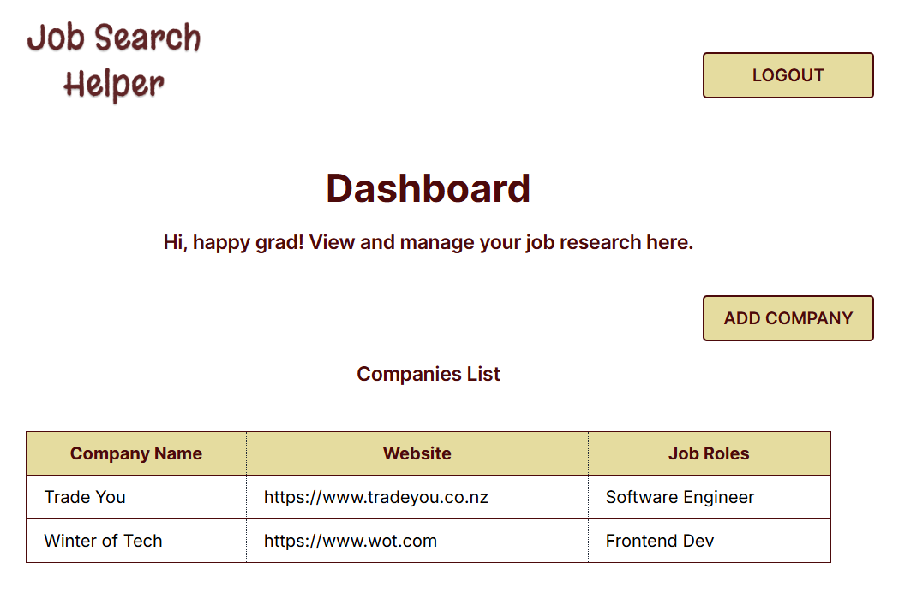

# Job Search Helper
## Overview
This MVP was created to join Chingu Voyage!  
It helps users record jobs they are interested in and manage related company information. The platform includes the basic features required for the Chingu Solo Project and makes it easier for registered users to track their job or company research.

*Sample screenshot*:

## Features
Users can:
- Sign up, log in, and log out
- Add, edit, and delete research entries    
- View the company list to quickly see the name, website, and job title  

## Tech Stack
**Frontend**
- React
- React Router
- Axios
- React Hook Form
- Tailwind CSS
- TypeScript
- Zod

**Backend**
- Django REST Framework (see the [Job Search Helper backend repository](https://github.com/AkoKBIkeda/job-search-helper-backend))

## Possible Improvements
This MVP meets the Chingu Solo Project requirements and is not actively maintained. If revisited, the following enhancements could be made:    
- Provide descriptions to guide users
- Refine labels, wording, alert messages, layout, and overall design
- Implement a "Forgot Password" feature
- Aggregate ratings to show how well each job aligns with user preferences in the company list  

## Licence
This project is released under the MIT License. See the [LICENSE](./LICENSE) file for full details.
